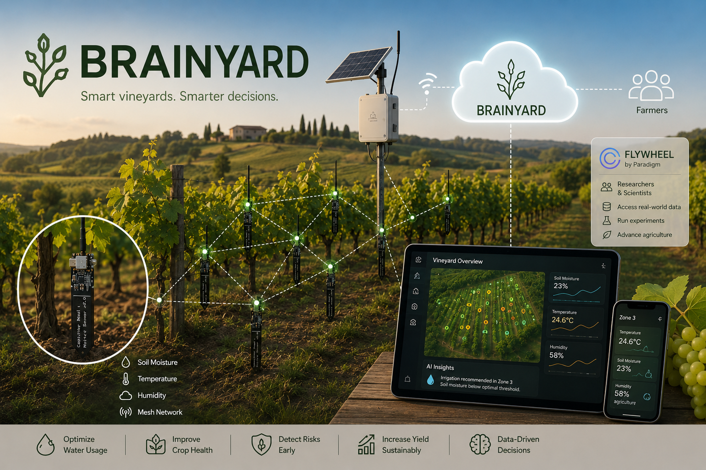

# Brainyard

**Brainyard** is a smart agriculture platform developed during **HackRome 2026** by **The Hitchhikers** team.

Our vision is to create an **off-grid wireless mesh network of environmental sensing nodes** capable of monitoring large agricultural areas such as vineyards, orchards, and crop fields in real time.


<br>

## Team

The project was proudly built by the students of [42 Roma ELIS](https://42roma.it)
* Susanna Kayed — backend wizard  [linkedin](https://www.linkedin.com/in/susanna-kayed/)
* Roman Alexandrov — hardware/firmware blacksmith   [linkedin](https://www.linkedin.com/in/roman-alexandrov-a75b89195/)
* Carlotta Cruciani — frontend genius  [linkedin](https://www.linkedin.com/in/carlotta-cruciani-6a8604358/)

<br>

## The Idea

Brainyard combines low-power sensor nodes, mesh networking, cloud infrastructure, and AI-powered analytics to help farmers make better decisions based on real-world environmental data.

Each field node contains sensors capable of measuring:

* Soil moisture
* Temperature
* Air humidity

Nodes communicate with nearby nodes, forming a self-organizing mesh network. Data is relayed across the network until it reaches a central base station connected to the internet.

The base station forwards collected information to the Brainyard backend, where it becomes available through a web application.

<br>

## Benefits

By continuously monitoring environmental conditions across an entire field or vineyard, Brainyard can help users:

* Optimize irrigation and reduce water consumption
* Detect microclimate differences across the field
* Identify conditions that may promote plant diseases or fungal growth
* Receive early warnings about drought stress and other environmental risks
* Improve crop health and yield through data-driven decisions
* Build long-term historical datasets for agricultural analysis

<br>

## AI-Powered Insights

Collected data is analyzed by AI services that can:

* Detect potentially harmful conditions
* Generate alerts and recommendations
* Suggest irrigation improvements
* Help farmers react before problems become visible in the field
* Support data-driven agricultural planning

<br>

## Research Integration

Brainyard is designed not only for farmers but also for researchers and scientists.

Field owners can share collected data with research institutions through **Flywheel** by Paradigm.

This enables researchers to:

* Access real-world environmental datasets
* Conduct agricultural and climate-related studies
* Develop and validate predictive models
* Explore new approaches to precision agriculture

<br>

## System Architecture

```text
Sensor Nodes
      ↓
Wireless Mesh Network
      ↓
Central Base Station
      ↓
Brainyard Backend   →   Flywheel (Paradigm)
      ↓                         ↓
Frontend Dashboard         Researchers
      ↓
AI Analysis &
Recommendations
```
<br>

## HackRome MVP

During HackRome 2026, we developed a functional hardware proof-of-concept demonstrating the Brainyard vision. The prototype node was capable of collecting environmental data as well as passing it wirelessly to the backend and served as the foundation for the future distributed sensing network.

<br>

## Future Development

* Solar-powered nodes
* Expanded sensor support
* Larger mesh deployments
* Predictive disease detection
* Advanced AI agronomic recommendations
* Field-wide digital twin visualization
* Research collaboration tools

<br>
---

Built during HackRome 2026 by **The Hitchhikers**.
